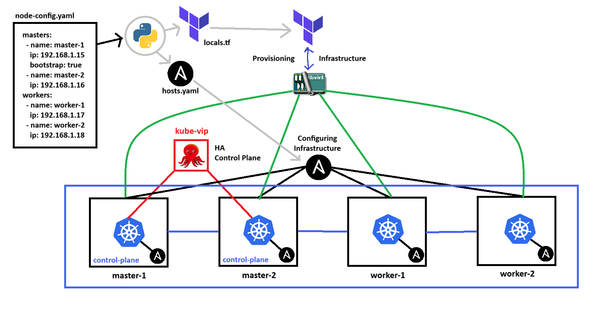

# Reproducible Infrastructure for Kubernetes On-premise with Libvirt


In this repository, I will be making IaC configs for auto-provisioning a Kubernetes Cluster with kubeadm for bootstrapping and kube-vip for High Availability.

Before trying these in your own machine, please read the requirements and considerations below:
- This terraform and ansible IaC configuration assumes you're in a local network with the subnet of 192.168.1.0/24, and DNS 8.8.8.8, if the parameters are different, kindly change in `config/generate_config.py`.
- The host machine uses Libvirt API which Terraform uses to interact with, creating, and managing the virtual machines.
- The ansible configuration works anywhere, as long as the configuration at `ansible/inventory/group_vars/all.yaml` are properly configured to the correct version.
- The full instructions and reasonings are explained at https://blog.lgkentang.com/ , this README only shows how to quickstart and provision the cluster.


0. The zero-th step is to install the ISO into your host machine, this is essential because we do not want to be pulling each ISO for each node.
    ```bash
    # Installing the image
    wget https://cloud-images.ubuntu.com/focal/current focal-server-cloudimg-amd64.img -O focal-20.04-base.qcow2

    # Import to libvirt
    virsh vol-create-as default focal-20.04-base.qcow2 10G --format qcow2 --prealloc-metadata
    virsh vol-upload --pool default focal-20.04-base.qcow2 focal-20.04-base.qcow2
    ```

1. To start, first define the configuration at `node-config.yaml`
    ```yaml
    # node-config.yaml

    masters:
    - name: master-1
        ip: 192.168.1.15
        bootstrap: true
    - name: master-2
        ip: 192.168.1.16
    workers:
    - name: worker-1
        ip: 192.168.1.17
    - name: worker-2
        ip: 192.168.1.18
    ```
    - Define the master and workers IP and name, these will be passed onto the `cloud-init.tmpl` and `network-config.tmpl` file. 
    - Bootstrap means the first node to initialize kubeadm

2. Given that you have installed python3, run the configuration generation by executing:
    ```bash
    python3 config/generate_config.py
    ```
    - This command will parse `node-config.yaml`and auto-generate `ansible/inventory/hosts.yaml` along with `terraform/locals.tf`.

3. Run these terraform commands, plan to view execution plan, apply to execute the plan
    ```bash
    cd terraform
    terraform plan
    terraform apply --auto-approve
    ```

4. Run these ansible commands:
    ```bash
    cd ../ansible
    ANSIBLE_HOST_KEY_CHECKING=False ansible -i inventory/hosts.yaml all -m ping
    ansible-playbook playbooks/01-common.yaml
    ansible-playbook playbooks/02-master.yaml
    ansible-playbook playbooks/03-master-join.yaml
    ansible-playbook playbooks/04-worker.yaml
    ```
    - Disable the host key checking to bypass checking the `~/.ssh/known_hosts` file, because we are using Ansible as a Master, not as a SSH user
    - Play the ansible playbooks sequentially to initialize, configure, and join the nodes to assemble a fresh Kubernetes Cluster

4. (Optional) `./remove_hosts.sh`, run this if you're just testing out the IaC, otherwise I wouldn't recommend using this command.
    - I used this command because when provisioning a new cluster, even though the IP's stayed the same, the host key verification changes which triggers a MITM warning to the user when trying to login to a fresh provisioned cluster.
    - This command easily removes all existing host key verification and starts the SSH fresh again


5. (Optional) To destoy the environment, easily execute this command, this ensures we are not deleting the base ISO image, but even if you wanted to it is already marked as undestroyable.
    ```bash
    terraform destroy \
    -target=libvirt_domain.vm_master \
    -target=libvirt_domain.vm_worker \
    -target=libvirt_cloudinit_disk.cloudinit_master \
    -target=libvirt_cloudinit_disk.cloudinit_worker \
    -target=libvirt_volume.ubuntu_disk_master \
    -target=libvirt_volume.ubuntu_disk_worker \
    -target=libvirt_network.bridged_network \
    --auto-approve
    ```
